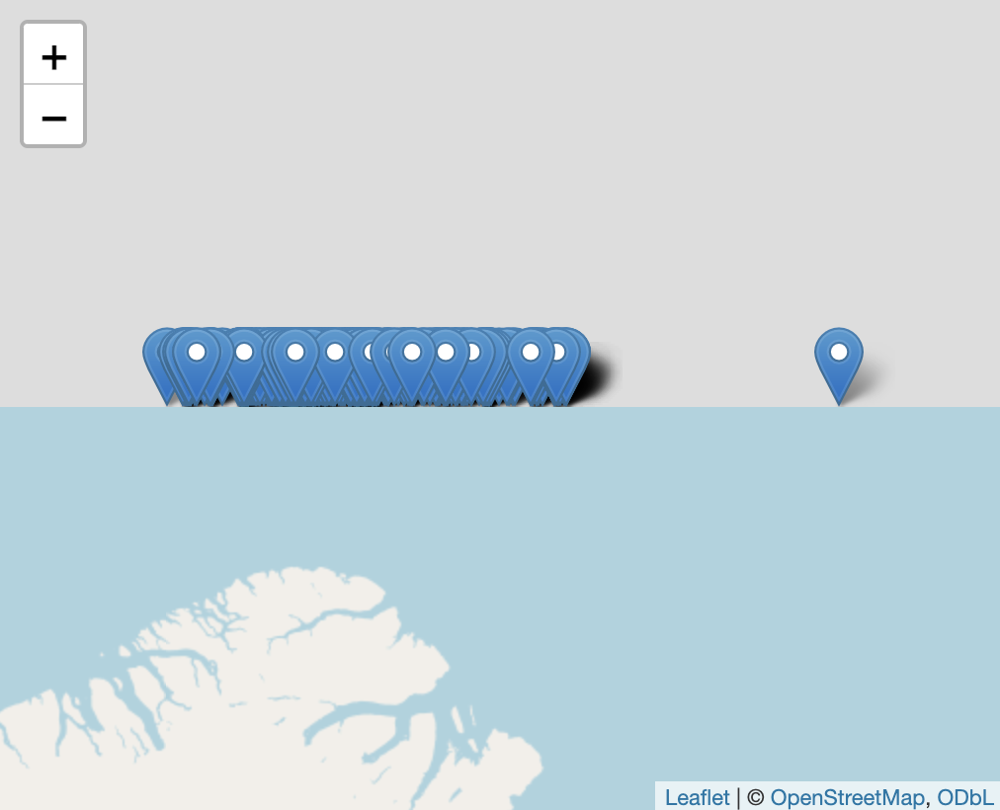
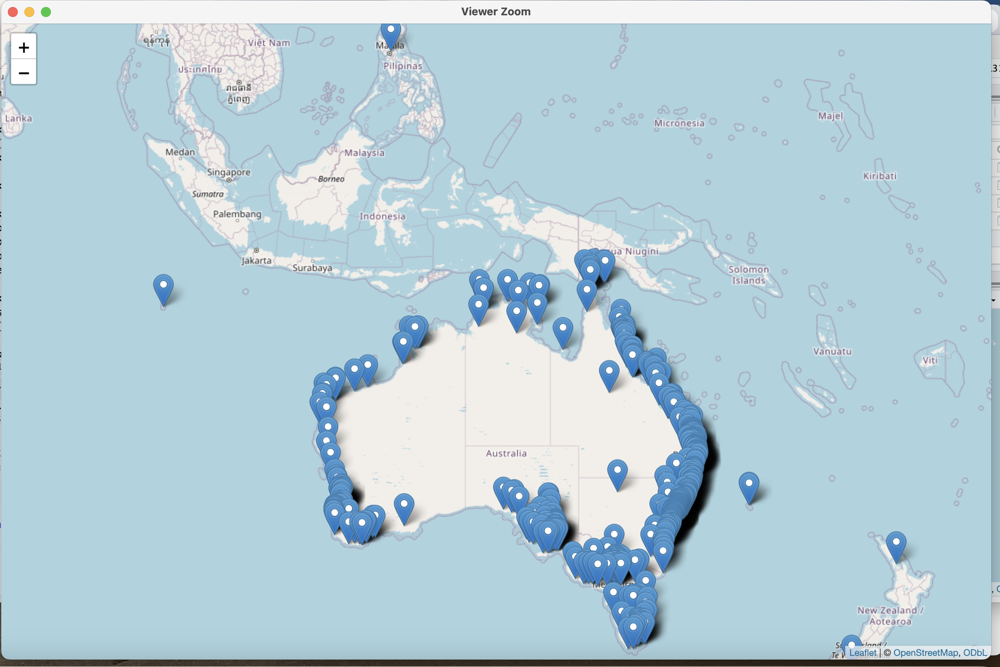
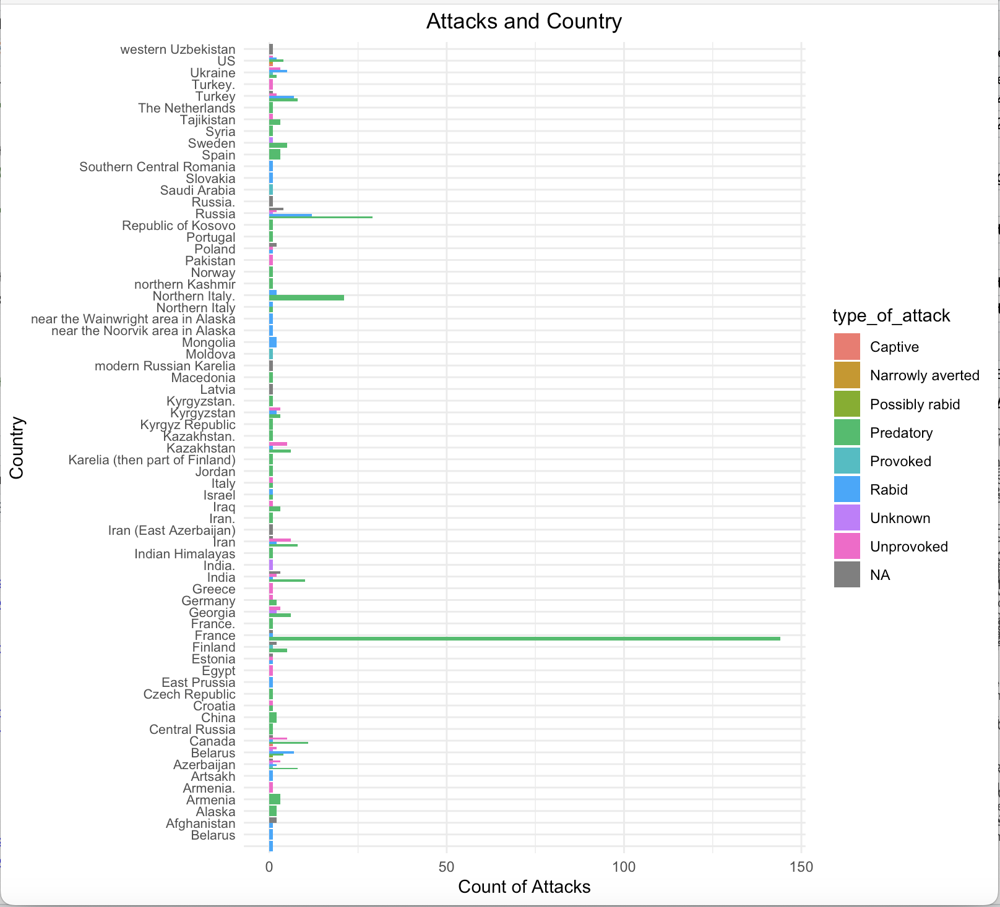
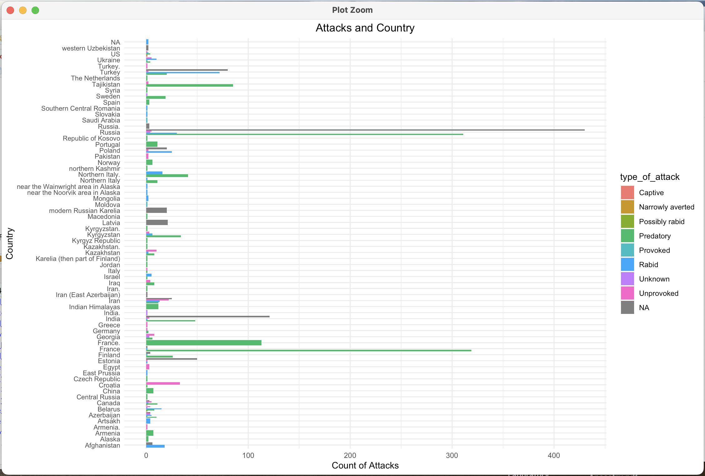

```{r setup, include = FALSE}
knitr::opts_chunk$set(echo = TRUE, cache = TRUE, warning = FALSE, message = FALSE)
```

[Return to Homepage](../index.html)

# **Introduction**
In the following report, I will investigate and examine which animal is the king of attacks whether on land or in the water, by comparing the attacks from sharks, wolves, and alligators. While this data has already been somewhat cleaned and contains fairly simple information, this final project aims to investigate the disparities between these three animals, the attack locations, and the effected population. In simpler terms, who is responsible for the most attacks? Which populations are the most effected? Were these attacks provoked or not? These are just some of the questions I hope to explore in this writing. 

# **Background**
This project was inspired in part by my family, my mother is from Florida and there have been some very interesting documentaries done on all these animals. It was also inspired by general happen stance: I found a very nice data set on Kaggle and felt it could be an interesting take on a seemingly dull data set. As mentioned, this data set was found: 

[Fatal Alligator Attacks](https://www.kaggle.com/datasets/danela/fatal-alligator-attacks-us?resource=download&select=fatal_alligator_attacks_US.csv)

[Shark Attacks](https://www.kaggle.com/datasets/felipeesc/shark-attack-dataset?phase=FinishSSORegistration&returnUrl=%2Fdatasets%2Ffelipeesc%2Fshark-attack-dataset%2Fversions%2F1%3Fresource%3Ddownload&SSORegistrationToken=CfDJ8PHSCL9k9s1HuJ2cRFBFhuhgpxN0g_ATDITz_-cXVG-n5-S8PcAnZdgDXHbn7ud0iaVYLeYWkYnFTY6Nc4JFt1nyWAZsTuhR8vSPv3ok5TP4AtRRK9-IzGDqSzZKUGxMayKK5NKkdWgewUVYPMF1aJl4phPB4ObwXl2AK7698CE230yss9kgbAVKcZACBg00FmSPPkTsYGhlWu4z3VrezvZDXoLn2eYayI0784JDAnaa1L5KVsvpzolGTk9T8hn7uDtX29rwNRaQWy19BsV0KZ7TcfDfFpYvRD8rSMrq4yEul7-CRa2L1R5qWvxEOYMlGI-VFN87sgabOPrg_CJ6jcJaVo0CcsQ&DisplayName=Meaghan+Barrett)

[Shark Attacks By Hemispheres](https://www.kaggle.com/code/icecream4/shark-attacks-by-hemispheres/notebook) 

[Global Wolf Attacks](https://www.kaggle.com/datasets/danela/global-wolf-attacks?select=global_wolves.csv) 

The data set consists of various reported statistics regarding these different attacks. Most types of attacks were not only predatory, but unprovoked. However, some individuals were reported to provoke the animal. Different age groups were attacked each time. 

Prevention would be great, but there are not signs for those that will and could be attacked. Alligators, sharks, and wolves have different reasons to attack.  

# **Data**
```{r, echo = TRUE}
# load all necessary libraries 
library(tidyverse)
library(janitor)
library(leaflet)
library(dplyr)
library(ggplot2)
library(lubridate)
library(stringr)
library(readr)
library(RColorBrewer)


# reading in kaggle data sets 
gator <- read.csv("predators/fatal_alligator_attacks_US.csv")

g_wolves <- read.csv("predators/global_wolves.csv")

shark_1 <- read.csv("predators/Shark_attacks/attacks.csv")

shark_2 <- read.csv("predators/shark_attacks.csv")

shark_3 <- read.csv("predators/Shark_attacks/list_coor_australia.csv")

```
This data set was retrieved from Kaggle and has already been **somewhat** cleaned for analysis. However, there are some changes I wanted to make to the data structure, changing missing values/empty spaces, cleaning the names, and improving characters found throughout the data set. The following code and outputs demonstrate the changes I've made to allow for smoother data analysis: 

```{r, echo=TRUE}

# convert column titles to snake_case 

gator <-clean_names(gator)

g_wolves <-clean_names(g_wolves)

shark_1 <- clean_names(shark_1)

shark_2 <-clean_names(shark_2)
```

```{r eval = TRUE}
# converts all N/A chr values to actual missing values and fills in empty spaces with missing values 

g_wolves$type_of_attack[is.na(g_wolves$type_of_attack) | g_wolves$type_of_attack == ""] <- "Unknown"

shark_2$type[is.na(shark_2$type) | shark_2$type == "Invalid"] <- "Unknown"

shark_1 <- shark_1[!is.na(shark_1$type), ] 
shark_1_subset <- shark_1[1:6302, ]
nrow(shark_1)
length(shark_1$type)

# Check which rows have NA or invalid values
table(is.na(shark_1$type))  
table(shark_1$type == "Invalid")  

# Replace only NAs first, then Invalids
shark_1$type[is.na(shark_1$type)] <- "Unknown"
shark_1$type[shark_1$type == "Invalid"] <- "Unknown"


# converts data structure to more appropriate data types
gator <-gator %>% 
  mutate(location = str_extract(details, "(Miami|Florida|Georgia|Texas|Louisiana|South Carolina)"),
         location = ifelse(location == "Miami", "Florida", location))

```

# **Alligator**


```{r, out.width="70%", out.height="70%"}

```

Picture came from [TreeHugger](https://www.treehugger.com/alligator-facts-5119214)

Alligators are beautiful and dangerous animals. This data only shows a small amount of deaths that have been caused by alligators. There was no information about crocodiles (crocs), even though they do have a hand in many deaths over the years, since invading the South. This data shows that Florida has had the most number of attacks. I have learned over the years, to keep an eye out whenever by water on the Southern coast. You never know what might snap you up. 

```{r, echo = FALSE}
gator %>%
  mutate(date = as.Date(date, format = "%B %d, %Y")) %>% 
  filter(!is.na(date)) %>% 
  filter(age != "?") %>%
  mutate(age = as.numeric(age)) %>%
  filter(age >= 2 & age <= 81) %>%
  mutate(year = as.integer(format(date, "%Y"))) %>%  
  arrange(age) %>%
  group_by(location) %>%
  ggplot(aes(x = factor(year), y = age, color = location)) + 
  geom_point() +
  theme(
    axis.text.x = element_text(angle = 90, hjust = 1, size = 14),
    axis.text.y = element_text(size = 14),
    axis.title.x = element_text(size = 16),
    axis.title.y = element_text(size = 16),
    legend.title = element_text(size = 14),
    legend.text = element_text(size = 12),
    plot.title = element_text(size = 18, face = "bold")
  ) +
  labs(x = "Year", y = "Age", title = "Gator Attacks: Ages vs. Location")

```


```{r, echo=FALSE}
deaths <-gator %>%
  filter(location != "?") %>%  
  filter(sex != "?") %>%       
  group_by(location, sex) %>%
  tally()

print(deaths)

victims_by_state <- deaths %>% 
  ggplot(aes(x = location, y = n, fill = sex)) +
  geom_bar(stat = "identity", position = "dodge") +  
  geom_text(aes(label = n), position = position_dodge(width = 0.9), vjust = -0.5, size = 3) +
  theme(
    axis.text.x = element_text(angle = 90, hjust = 1, size = 14),
    axis.text.y = element_text(size = 14),
    axis.title.x = element_text(size = 16),
    axis.title.y = element_text(size = 16)
  ) + 
  labs(
    title = "Alligator Attacks by State",
    x = "State", y = "Number of Victims", fill = "Sex"
  )


victims_by_state
```

# **Unexpected Shark Attacks**
When I first started trying to create this plot, this was the result. Attacks happening above Greenland. I learned how wrong I was. 
```{r, out.width="70%", out.height="70%"}

```

# **Sharks**


```{r, out.width="70%", out.height="70%"}

```

Picture from [britannica](https://www.britannica.com/animal/shark)


If any of you have an unrealistic fear that there is something in the water and you will get attacked, you're not alone. Look what is happening in Australia. Zoom out and see what is happening.

```{r, echo = TRUE}

colnames(shark_3) <- c("latitude", "longitude")
center_lat <- -25.2744
center_lon <- 133.7751
zoom_level <- 5  

map <- leaflet() %>%
  addTiles() %>%  
  setView(center_lon, center_lat, zoom = zoom_level)

for (i in 1:nrow(shark_3)) {
  map <- map %>% addMarkers(lng = shark_3$longitude[i], lat = shark_3$latitude[i])
}

map

```


```{r, out.width="100%", out.height="100%"}

```


This is what the map looks like when zoomed out. Crazy, right?


#  **More Attacks**
```{r, echo=TRUE}

shark_1$type[is.na(shark_1$type) | shark_1$type == ""] <- "Unknown"
shark_1$type[is.na(shark_1$type) | shark_1$type == "Invalid"] <- "Unknown"
shark_1_subset <- shark_1[1:6302, ]

sharks <- shark_1 %>% 
  group_by(country) %>% 
  ggplot(aes(x = type)) +
  geom_bar(aes(y = ..count..)) + 
  geom_text(stat = 'count', aes(label = ..count..), vjust = -0.5) +
  theme(axis.text.x = element_text(angle = 45, hjust = 1, size = 14),  
        axis.text.y = element_text(size = 14),  
        plot.title = element_text(hjust = 0.5, size = 16),  
        axis.title.x = element_text(size = 16),  
        axis.title.y = element_text(size = 16)) + 
  labs(title = "Shark Attacks by Type", 
       x = "Type of Attack", 
       y = "Count of Attacks")

# Plot the chart
plot(sharks)

```


Does anyone have an idea what boatomg is? I think they meant boating, but messed up on their English. It is understandable to a degree, English is hard. 


# **More Shark Attacks**
```{r, echo = TRUE}
shark_2$type[is.na(shark_2$type) | shark_2$type == "Invalid"] <- "Unknown"

shark_2 %>% 
  group_by(area) %>% 
  ggplot(aes(x = type)) +
  geom_bar(aes(y = ..count..)) + 
  geom_text(stat = 'count', aes(label = ..count..), vjust = -0.5) +
  theme(
    axis.text.x = element_text(angle = 45, hjust = 1, size = 14),  
    axis.text.y = element_text(size = 14),  
    axis.title.x = element_text(size = 16),  
    axis.title.y = element_text(size = 16),
    plot.title = element_text(hjust = 0.5, size = 18, face = "bold")  # Center and style the title
  ) + 
  labs(
    title = "Shark Attacks by Type", 
    x = "Type of Attack", 
    y = "Count of Attacks"
  )

```
```{r, echo=TRUE}

top_countries <- shark_2 %>%
  count(country, sort = TRUE) %>%
  top_n(15, n) %>%
  pull(country)


shark_2 %>%
  filter(country != "",country %in% top_countries) %>%
  mutate(month = month(as.Date(date, format = "%d-%B-%Y"), label = TRUE)) %>%
  filter(!is.na(month)) %>%
  group_by(country, month) %>%
  summarise(attacks = n(), .groups = "drop") %>%
  mutate(area = fct_reorder(country, attacks, .fun = sum)) %>%
  ggplot(aes(x = country, y = month)) +
  geom_point(aes(size = attacks, color = attacks), alpha = 0.7) +
  scale_size_continuous(range = c(2, 10)) +
  scale_color_gradient(low = "skyblue", high = "red") +
  labs(
    x = "Country",
    y = "Month",
    size = "Number of Attacks",
    color = "Number of Attacks",
    title = "Shark Attacks by Month"
  ) +
  theme_minimal(base_size = 14) +
  theme(axis.text.x = element_text(angle = 90, hjust = 1)) +
  coord_flip()

```


# **USA**

```{r, echo=TRUE}

# List of all U.S. states
us_states <- c(
  "Alabama", "Alaska", "Arizona", "Arkansas", "California", "Colorado", "Connecticut", 
  "Delaware", "Florida", "Georgia", "Hawaii", "Idaho", "Illinois", "Indiana", "Iowa", 
  "Kansas", "Kentucky", "Louisiana", "Maine", "Maryland", "Massachusetts", "Michigan", 
  "Minnesota", "Mississippi", "Missouri", "Montana", "Nebraska", "Nevada", 
  "New Hampshire", "New Jersey", "New Mexico", "New York", "North Carolina", 
  "North Dakota", "Ohio", "Oklahoma", "Oregon", "Pennsylvania", "Rhode Island", 
  "South Carolina", "South Dakota", "Tennessee", "Texas", "Utah", "Vermont", 
  "Virginia", "Washington", "West Virginia", "Wisconsin", "Wyoming"
)

# Now filter based on U.S. states
shark_2 %>%
  filter(country == "USA", area %in% us_states) %>%
  mutate(month = month(as.Date(date, format = "%d-%B-%Y"), label = TRUE)) %>%
  filter(!is.na(month)) %>%
  group_by(area, month) %>%
  summarise(attacks = n(), .groups = "drop") %>%
  mutate(area = fct_reorder(area, attacks, .fun = sum, .desc = TRUE)) %>%
  ggplot(aes(x = area, y = month)) +
  geom_point(aes(size = attacks, color = attacks), alpha = 0.7) +
  scale_size_continuous(range = c(2, 10)) +
  scale_color_gradient(low = "skyblue", high = "red") +
  labs(
    x = "States",
    y = "Month",
    size = "Number of Attacks",
    color = "Number of Attacks",
    title = "Shark Attacks by Month in U.S.A."
  ) +
  theme_minimal(base_size = 14) +
  theme(axis.text.x = element_text(angle = 90, hjust = 1)) +
  coord_flip()

```


# **When Comparing: USA vs. Australia**

```{r, echo=TRUE}
shark_2 %>%
  filter(country %in% c("USA", "AUSTRALIA")) %>%
  mutate(month = month(as.Date(date, format = "%d-%B-%Y"), label = TRUE)) %>%
  filter(!is.na(month)) %>%
  group_by(country, month) %>%
  summarise(attacks = n(), .groups = "drop") %>%
  ggplot(aes(x = month, y = attacks)) +
  geom_point(aes(size = attacks, color = attacks), alpha = 0.7) +
  scale_size_continuous(range = c(2, 10)) +
  scale_color_gradient(low = "skyblue", high = "red") +
  labs(
    x = "Month",
    y = "Number of Attacks",
    size = "Number of Attacks",
    color = "Number of Attacks",
    title = "Monthly Shark Attacks: USA vs Australia"
  ) +
  theme_minimal(base_size = 14) +
  theme(axis.text.x = element_text(angle = 45, hjust = 1)) +
  facet_wrap(~ country, ncol = 1)

```

#  **Wolves: Before Cleaning**


```{r, out.width="70%", out.height="70%"}

```


Picture from [britannica-Wolves](https://www.britannica.com/animal/wolf)


```{r, echo=TRUE}
g_wolves$type_of_attack[is.na(g_wolves$type_of_attack) | g_wolves$type_of_attack == ""] <- "Unknown"

wolves <- g_wolves %>% 
  group_by(type_of_attack) %>% 
  ggplot(aes(x = type_of_attack))  +
  geom_bar(aes(y = ..count..)) + 
  geom_text(stat = 'count', aes(label = ..count..), vjust = -0.5) +
  theme(
    axis.text.x = element_text(angle = 45, hjust = 1, size = 14),  
    axis.text.y = element_text(size = 14), 
    axis.title.x = element_text(size = 16),  
    axis.title.y = element_text(size = 16)  
  ) +
  labs(x = "Types of Attacks", y = "Victim Count")

plot(wolves)

```


When I was looking and trying to clean the data, there were many factors that affected it. The data was not pretty even after trying to clean it. The attacks are even higher than data above. There was some data that represented 15 people that were killed by wolves. All 15 people were placed on the same line. This is how it looked before really cleaning the data. 

```{r, echo=TRUE}
# Read the CSV file (assuming it's saved as 'global_wolves.csv')
data <- read.csv("predators/global_wolves.csv", stringsAsFactors = FALSE)

data <- clean_names(data)

# Use a regular expression to extract the country from the 'Location' column
data$country <- sub(".*,\\s*(.*)$", "\\1", data$location)

# Extract the country from location string
data$country <- str_extract(data$location, "[^,]+$")

# Trim any leading/trailing whitespace
data$country <- trimws(data$country)

# Replace blank box with NA
data <- data %>%
  mutate(type_of_attack = ifelse(type_of_attack == "", NA, type_of_attack))

data %>% 
  ggplot(aes(x = country, fill = type_of_attack)) +
  geom_bar(position = "dodge") +
  coord_flip() + 
  theme(axis.text.x = element_text(angle = 45, hjust = 1)) +  
  labs(title = "Attacks and Country",
       x = "Country",
       y = "Count of Attacks") +
  theme_minimal()+
  theme(
    plot.title = element_text(hjust = 0.5),
    axis.text.y = element_text(size = 8))  
```

```{r, out.width="100%", out.height="100%"}

```


# **Clean-ish Wolves Data**

```{r, echo=TRUE}
### Attempt 2
# Load the CSV
df <- read_csv("predators/global_wolves.csv") %>% 
  clean_names()

# Function to split or duplicate victims
expand_victims <- function(victim_string, row_data) {
  row_data <- as_tibble(row_data)  
  
  # Insert separator where gender is jammed with next name, like "maleAlex"
  victim_string <- str_replace_all(victim_string, "(male|female)(?=[A-Z])", "\\1; ")
  
  # Case 1: multiple named people
  if (str_detect(victim_string, "[A-Za-z]+, \\d{1,2}, (male|female)")) {
    people <- str_extract_all(victim_string, "[^,]+, \\d{1,2}, (male|female)")[[1]]
    return(map_df(people, ~ mutate(row_data, victims = .x)))
  }
  
  # Case 2: vague with number
  number_match <- str_match(victim_string, "(\\d+)|([Tt]wo|[Tt]hree|[Ff]our|[Ff]ive|[Ss]ix|[Ss]even|[Ee]ight)")
  if (!is.na(number_match[1])) {
    num <- suppressWarnings(as.numeric(number_match[1]))
    if (is.na(num)) {
      num <- case_when(
        str_detect(number_match[1], regex("two", ignore_case = TRUE)) ~ 2,
        str_detect(number_match[1], regex("three", ignore_case = TRUE)) ~ 3,
        str_detect(number_match[1], regex("four", ignore_case = TRUE)) ~ 4,
        str_detect(number_match[1], regex("five", ignore_case = TRUE)) ~ 5,
        str_detect(number_match[1], regex("six", ignore_case = TRUE)) ~ 6,
        str_detect(number_match[1], regex("seven", ignore_case = TRUE)) ~ 7,
        str_detect(number_match[1], regex("eight", ignore_case = TRUE)) ~ 8,
        str_detect(number_match[1], regex("eight", ignore_case = TRUE)) ~ 9,
        str_detect(number_match[1], regex("eight", ignore_case = TRUE)) ~ 10,
        str_detect(number_match[1], regex("eight", ignore_case = TRUE)) ~ 11,
        str_detect(number_match[1], regex("eight", ignore_case = TRUE)) ~ 12,
        str_detect(number_match[1], regex("eight", ignore_case = TRUE)) ~ 13,
        str_detect(number_match[1], regex("eight", ignore_case = TRUE)) ~ 14,
        str_detect(number_match[1], regex("eight", ignore_case = TRUE)) ~ 15,
        TRUE ~ 1
      )
    }
    return(map_df(1:num, ~ mutate(row_data, victims = "Unknown")))
  }
  
  # Default: return original row
  return(row_data)
}

# Apply to each row
cleaned_df <- df %>%
  rowwise() %>%
  do(expand_victims(.$victims, .)) %>%
  ungroup()

# First extract the country
cleaned_df <- cleaned_df %>%
  mutate(country = str_extract(location, "[^,]+$") %>% str_trim())

# Then remove any trailing periods
cleaned_df <- cleaned_df %>%
  mutate(country = str_remove(country, "\\.$"))

cleaned_df %>% 
  ggplot(aes(x = country, fill = type_of_attack)) +
  geom_bar(position = "dodge") +
  coord_flip() + 
  theme(axis.text.x = element_text(angle = 45, hjust = 1)) +  
  labs(title = "Attacks and Country",
       x = "Country",
       y = "Count of Attacks") +
  theme_minimal()+
  theme(
    plot.title = element_text(hjust = 0.5),
    axis.text.y = element_text(size = 8))  


```

```{r, out.width="100%", out.height="100%"}

```


# **Cleaner Wolf Data**

```{r, echo=TRUE}
# Load and clean the dataset
df <- read_csv("predators/global_wolves.csv") %>% 
  clean_names()

# Function to expand victims and extract age & sex
expand_victims <- function(victim_string, row_data) {
  row_data <- as_tibble(row_data)  
  
  victim_string <- str_replace_all(victim_string, "(male|female)(?=[A-Z])", "\\1; ")

  if (str_detect(victim_string, "[A-Za-z]+,? ?\\d{1,2}, (male|female)")) {
    people <- str_extract_all(victim_string, "[^,;]+,? ?\\d{1,2}, (male|female)")[[1]]
    
    return(map_df(people, function(person) {
      age <- str_extract(person, "\\d{1,2}") %>% as.numeric()
      sex <- str_extract(person, "male|female")
      mutate(row_data, victims = person, age = age, sex = sex)
    }))
  }

  number_match <- str_match(victim_string, "(\\d+)|([Tt]wo|[Tt]hree|[Ff]our|[Ff]ive|[Ss]ix|[Ss]even|[Ee]ight|[Nn]ine|[Tt]en|[Ee]leven|[Tt]welve|[Tt]hirteen|[Ff]ourteen|[Ff]ifteen)")
  
  if (!is.na(number_match[1])) {
    num <- suppressWarnings(as.numeric(number_match[1]))
    if (is.na(num)) {
      num <- case_when(
        str_detect(number_match[1], regex("two", ignore_case = TRUE)) ~ 2,
        str_detect(number_match[1], regex("three", ignore_case = TRUE)) ~ 3,
        str_detect(number_match[1], regex("four", ignore_case = TRUE)) ~ 4,
        str_detect(number_match[1], regex("five", ignore_case = TRUE)) ~ 5,
        str_detect(number_match[1], regex("six", ignore_case = TRUE)) ~ 6,
        str_detect(number_match[1], regex("seven", ignore_case = TRUE)) ~ 7,
        str_detect(number_match[1], regex("eight", ignore_case = TRUE)) ~ 8,
        str_detect(number_match[1], regex("nine", ignore_case = TRUE)) ~ 9,
        str_detect(number_match[1], regex("ten", ignore_case = TRUE)) ~ 10,
        str_detect(number_match[1], regex("eleven", ignore_case = TRUE)) ~ 11,
        str_detect(number_match[1], regex("twelve", ignore_case = TRUE)) ~ 12,
        str_detect(number_match[1], regex("thirteen", ignore_case = TRUE)) ~ 13,
        str_detect(number_match[1], regex("fourteen", ignore_case = TRUE)) ~ 14,
        str_detect(number_match[1], regex("fifteen", ignore_case = TRUE)) ~ 15,
        TRUE ~ 1
      )
    }
    
    return(map_df(1:num, ~ mutate(row_data, victims = "Unknown", age = NA, sex = NA)))
  }

  sex <- str_extract(victim_string, "male|female")
  age <- str_extract(victim_string, "\\d{1,2}") %>% as.numeric()
  
  return(mutate(row_data, victims = victim_string, age = age, sex = sex))
}

# Expand victims into individual rows
cleaned_df <- df %>%
  rowwise() %>%
  do(expand_victims(.$victims, .)) %>%
  ungroup()

# Clean country info from 'location' column
cleaned_df <- cleaned_df %>%
  mutate(
    country = str_extract(location, "[^,]+$") %>% str_trim(),
    country = str_remove(country, "\\.")
  ) %>%
  filter(!is.na(country) & country != "")

# Get top 15 countries by number of attacks
top_countries <- cleaned_df %>%
  count(country, sort = TRUE) %>%
  slice_head(n = 15) %>%
  pull(country)

# Filter to just those countries
filtered_df <- cleaned_df %>%
  filter(country %in% top_countries)

filtered_df <- filtered_df %>%
  filter(!is.na(type_of_attack) & type_of_attack != "")

# Plot
filtered_df %>%
  ggplot(aes(x = fct_infreq(country), fill = type_of_attack)) +
  geom_bar(position = "dodge") +
  coord_flip() +
  theme_minimal() +
  labs(
    title = "Top 15 Countries with Wolf Attacks",
    x = "Country",
    y = "Number of Attacks",
    fill = "Attack Type"
  ) +
  theme(
    plot.title = element_text(hjust = 0.5, size = 18),
    axis.text.x = element_text(size = 12),
    axis.text.y = element_text(size = 12),
    axis.title.x = element_text(size = 14),
    axis.title.y = element_text(size = 14),
    legend.title = element_text(size = 12),
    legend.text = element_text(size = 10)
  )

```


After cleaning the data, you can see, Russia and France both have many attacks.


```{r, echo=TRUE}
# Parse date column and extract month
filtered_df <- filtered_df %>%
  mutate(
    parsed_date = mdy(date), 
    month = month(parsed_date, label = TRUE, abbr = TRUE)  
  ) %>%
  filter(!is.na(month))

# Plot attacks by month with bigger fonts
filtered_df %>%
  ggplot(aes(x = month, fill = country)) +
  geom_bar(position = "dodge") +
  labs(
    title = "Wolf Attacks by Month",
    x = "Month",
    y = "Number of Attacks",
    fill = "Country"
  ) +
  theme_minimal() +
  theme(
    plot.title = element_text(hjust = 0.5, size = 22, face = "bold"),
    axis.text.x = element_text(size = 14),
    axis.text.y = element_text(size = 14),
    axis.title.x = element_text(size = 16, face = "bold"),
    axis.title.y = element_text(size = 16, face = "bold"),
    legend.title = element_text(size = 16, face = "bold"),
    legend.text = element_text(size = 14)
  )

```


This shows the months of attack. Some of the attacks are dated clear back 1340, while others are newer (2022).  


# **Who is King?**

```{r, echo=TRUE}

# 1. Summarize the number of attacks from each cleaned dataset

# Alligator
gator_attacks <- gator %>%
  filter(!is.na(date)) %>%
  nrow()

# Shark - Using shark_1 since it has most rows and was pre-cleaned
shark_attacks <- shark_1 %>%
  filter(!is.na(type), type != "Unknown") %>%
  nrow()

# Wolves - Using cleaned_df from wolf data
wolf_attacks <- cleaned_df %>%
  filter(!is.na(type_of_attack), type_of_attack != "") %>%
  nrow()

# 2. Create a comparison data frame
attack_king_df <- tibble(
  predator = c("Shark", "Alligator", "Wolf"),
  total_attacks = c(shark_attacks, gator_attacks, wolf_attacks)
)

# 3. Plot it
attack_king_df %>%
  ggplot(aes(x = reorder(predator, total_attacks), y = total_attacks, fill = predator)) +
  geom_col(width = 0.6) +
  geom_text(aes(label = total_attacks), vjust = -0.5, size = 4) +
  labs(
    title = "The King of Attacks",
    x = "Predator",
    y = "Documented Attacks"
  ) +
  scale_fill_manual(values = c("Shark" = "#FF3C38", "Alligator" = "#0C9463", "Wolf" = "#4C4C6D")) +
  theme_minimal(base_size = 16) +
  theme(
    plot.title = element_text(hjust = 0.5, face = "bold", size = 20),
    legend.position = "none"
  )

```


# **Long Live King Jaws**

The King of attacks is the shark. The data shows that sharks have the most attacks. Look at the map of Australia again, every marker is where a shark attack has occurred. Also, another reason why the shark data is king is due to a lack and missing data from both the wolves and gators. If there was data for Nile Crocs, there might be some competition. 


```{r, out.width="70%", out.height="70%"}

```

Picture from [britannica](https://www.britannica.com/animal/shark)


# **Tour Guide Tips**

When visiting Florida or Australia, watch your feet and surroundings. In Florida, pretty much everything wants to eat you from bugs to Alligators/Crocs, snakes, sharks, etc. It is a dangerous and wonderful place, as long as, you are careful. Besides, all the things that are wanting to eat you...make for a tasty meal on your dinner plate in the end. I want to return to Florida to get some croc/gator meat. Shark is not bad, it is just a fishy, chewy meat. 

Australia has a larger variety of dangers, a lot of shark attacks, poisonous snakes, jellyfish, crocs, and other dangers. PBS has been my guide to Australia. 

# **Main Points:**

1- Do not underestimate a predator by thinking they are slow

2- Watch your surroundings

3- Be careful when going near any water source

4- Don't provoke the wildlife

5- Do not feed the wildlife

6- Do not get close to the wildlife (Potential Death Risk)

7- If you are stung by a jellyfish rinse the area with water, do not urinate on it

8- If you are bit, (depending on what bit you and where you are bit) if you have a weapon, fight back. 

With crocs and gators: eyes, nose, or throat are recommended to stab at. If it is a snake or a insect get help, as soon as possible. 

If you are bit by a gator/croc, shark, snakes, ants, spiders, or any sort of wildlife get help ASAP, you can potentially die from a bacterial infection or rabies. 

Some snakes in Florida (cottonmouth snake) are just nasty and have a bad bacteria in their mouth that will cause gangrene. 


# **Honorable Mentions**

1- Golden Labs

2- Birds

3- Jellyfish

4- Etc. 